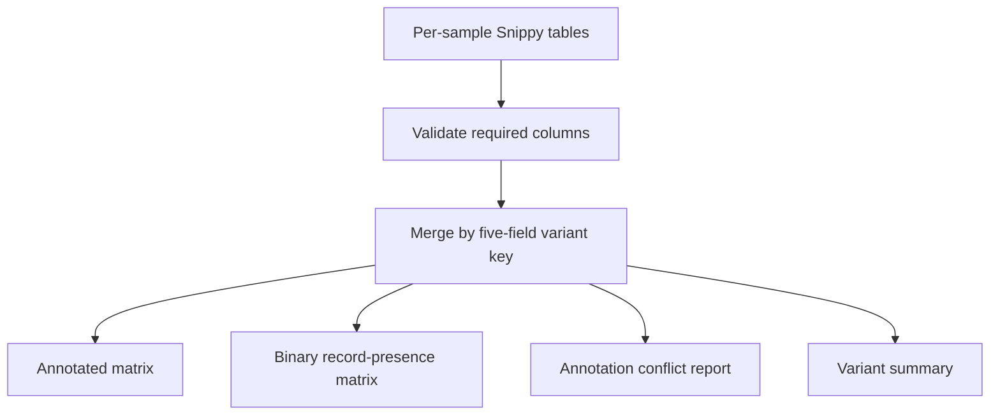

# Snippy Variant Matrix

Merge per-sample Snippy variant tables into a single annotated matrix and a binary record-presence matrix.

**Author:** Zirui Chen

Developed for comparative genomics workflows involving multiple samples analyzed against a shared reference.

## Overview

This script combines variant records using the five-field key:

```text
CHROM + POS + TYPE + REF + ALT
```

Each distinct key becomes one row, and each input sample becomes one column.

The script generates:

- An annotated matrix containing `REF>ALT` values for reported variants.
- A binary matrix indicating whether each variant appears in each sample's input table.
- A report of conflicting annotations.
- A summary of samples, variant types and input record counts.

Although the original script and output filenames use “SNP”, the script does not
filter by variant type. It retains all `TYPE` values present in the input tables.

## Workflow



## Requirements

- Python 3
- pandas

Install the dependency:

```bash
python3 -m pip install pandas
```

The script runs locally and does not make network requests.

## Input files

Place all sample tables in one directory.

The script searches for filenames matching:

```text
*_snps.tab
```

For example:

```text
sample_A_snps.tab
sample_B_snps.tab
sample_C_snps.tab
```

Each file represents one sample. The filename without `_snps.tab` becomes the
sample column name.

If your Snippy outputs are all named `snps.tab` in separate sample directories,
copy them into the input directory using distinct sample-prefixed filenames.
The current script does not search sample subdirectories recursively.

### Required columns

Input files must be tab-separated and contain a header with these columns:

| Column | Meaning |
| --- | --- |
| `CHROM` | Reference sequence or contig identifier |
| `POS` | Variant position |
| `TYPE` | Variant type as reported in the input |
| `REF` | Reference allele |
| `ALT` | Alternate allele |

`POS` must contain values that can be converted to integers.

### Optional annotation columns

The following columns are retained when present:

```text
FTYPE
STRAND
NT_POS
AA_POS
LOCUS_TAG
GENE
PRODUCT
EFFECT
```

Missing annotation columns are represented by empty values. Other input columns
are not included in the output matrices.

### Minimal input example

The following are synthetic examples, not research results. Fields must be
separated by tabs.

`sample_A_snps.tab`:

```text
CHROM	POS	TYPE	REF	ALT
chr1	100	snp	A	G
chr1	200	snp	C	T
```

`sample_B_snps.tab`:

```text
CHROM	POS	TYPE	REF	ALT
chr1	100	snp	A	G
chr1	300	snp	G	A
```

These inputs contain one shared variant and two variants recorded in only one
of the sample tables.

## Usage

Save the script as:

```text
build_master_snp_matrix_v2.py
```

### Run in the same directory as the input files

```bash
python3 build_master_snp_matrix_v2.py
```

Both the input and output directories default to the current working directory.

### Specify input and output directories

```bash
python3 build_master_snp_matrix_v2.py -i ./input -o ./results
```

| Argument | Default | Purpose |
| --- | --- | --- |
| `-i`, `--input` | `.` | Directory containing `*_snps.tab` files |
| `-o`, `--output` | `.` | Directory for generated results |

The output directory is created if needed. Existing output files with the same
names are overwritten, so use separate output directories for different runs.

## Output files

### 1. `Master_SNP_Matrix.csv`

An annotated variant-by-sample matrix.

Metadata columns are followed by one column per sample. Sample cells contain:

| Value | Meaning |
| --- | --- |
| `REF>ALT`, such as `A>G` | This exact variant key appears in the sample table |
| `0` | This exact variant key does not appear in the sample table |

For the synthetic inputs above, the sample portion is:

| Variant | sample_A | sample_B |
| --- | --- | --- |
| chr1:100 A>G | A>G | A>G |
| chr1:200 C>T | C>T | 0 |
| chr1:300 G>A | 0 | G>A |

Use this file to inspect shared and sample-associated variant records alongside
their annotations.

### 2. `Master_SNP_Binary.csv`

The same metadata and row order, with binary sample columns:

| Value | Meaning |
| --- | --- |
| `1` | The variant key is present in the sample's input table |
| `0` | The variant key is absent from the sample's input table |

For the synthetic example:

| Variant | sample_A | sample_B |
| --- | ---: | ---: |
| chr1:100 A>G | 1 | 1 |
| chr1:200 C>T | 1 | 0 |
| chr1:300 G>A | 0 | 1 |

Use the sample columns for downstream record-presence summaries, heatmaps or
group-based filtering. Select the sample columns explicitly; the CSV also
contains annotation and variant metadata.

**A zero is not a confirmed reference genotype.** An absent record may reflect
a reference call, insufficient coverage, filtering or another upstream cause.
The script does not distinguish these possibilities.

### 3. `Annotation_Mismatch_Report.txt`

Records conflicting non-empty annotations for the same five-field variant key.

Each conflict includes:

- The sample where the conflicting value was encountered.
- The variant identifier.
- The annotation field.
- The retained value (`OLD`).
- The differing value (`NEW`).

Input files are processed in sorted filename order. The first non-empty value
encountered for each annotation field is retained. A later non-empty value fills
an empty field; a differing non-empty value is logged without replacing the
retained annotation.

Conflicts are comparison events, not necessarily unique affected variants.
Use this report to inspect annotation discrepancies before interpreting results.

### 4. `Variant_Summary.txt`

Reports:

- Number of input samples.
- Number of unique five-field variant keys.
- Number of unique variants by `TYPE`.
- Number of annotation conflict events.
- Number of input rows processed per sample.

Per-sample counts are input row counts. Duplicate records within a sample
increase those counts, even though they occupy only one matrix cell.

## Matching and ordering

Variants are merged only when all five key fields match exactly:

```text
CHROM, POS, TYPE, REF, ALT
```

Two records at the same position with different alternate alleles remain
separate rows.

The current implementation compares keys as text before converting `POS` to an
integer for output sorting. Input formatting should therefore be consistent.

Rows are sorted by:

```text
CHROM, POS, TYPE, REF, ALT
```

Chromosome/contig names are sorted lexicographically, and positions numerically.
Sample columns follow sorted input filenames.

`Variant_ID` is a display label constructed by joining the five fields with
underscores. The actual merge uses the five-field tuple, not this display label.
Do not reconstruct the fields by splitting `Variant_ID` on underscores.

## Appropriate use

This tool supports comparative genomics by organizing variant calls across
samples into consistent tables.

For meaningful coordinate-based comparison, the samples should use the same
reference assembly, compatible contig names and comparable variant-calling
settings. Equivalent variants represented differently will not be merged
automatically.

The script does not:

- Call or normalize variants.
- Check reference compatibility.
- Evaluate coverage or genotype confidence.
- Produce a core-genome alignment.
- Infer a phylogenetic tree.
- Establish that a variant is biologically absent from a sample or lineage.

A variant recorded only in one sample or group should be treated as a candidate
for further examination, not automatically as a confirmed specific variant.

## Current limitations

This repository documents the original V2 implementation.

- Only `*_snps.tab` files directly inside the input directory are discovered.
- Sample names must be unique and must not equal metadata column names such as
  `POS`, `GENE` or `Variant_ID`.
- Use `_snps.tab` only as the terminal filename suffix; the original name
  extraction replaces every occurrence of that text.
- Required fields should be populated, with integer-compatible positions.
- The original pandas import treats some strings as missing values.
- A header-only sample table can accompany non-empty tables, but a collection
  with no variant rows across all samples is not handled by this version.
- Annotation conflicts are logged rather than biologically resolved.
- The matrices are built in memory; large datasets may require substantial RAM.

## Attribution

This script processes tables generated by Snippy and is an independent utility.

See the [Snippy project](https://github.com/tseemann/snippy) for the upstream
variant-calling software. Cite the appropriate upstream tools and reference
resources when reporting analyses.
